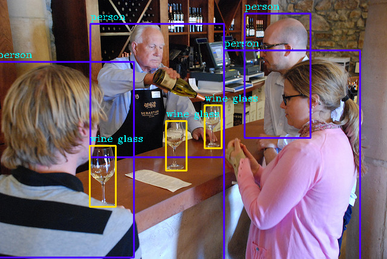

## Introduction

A Tensorflow Implementation of Yolov3.

## Prepare

+ pretrained darknet weights

    The pretrained darknet weights file can be downloaded [here](https://pjreddie.com/media/files/yolov3.weights). Place this weights file under directory **./data** and then run:
    
    ```
    python convert_weights.py
    ```
    
    and then, we will get:
    
    ```
    |--data
        |--checkpoints
               |--checkpoint
               |--yolov3.ckpt.data-00000-of-00001
               |--yolov3.ckpt.index
               |--yolov3.ckpt.meta 
    
    ```

+ anchors

    Put anchors in the **./data/anchor.txt**

## Detect

+ use coco model

    ```
    python detect.py --image_path utils/2008_000289.jpg
    ```
    or

+ use our trained model

    ```
    python detect.py --image_path utils/COCO_test2014_000000000069.jpg --ckpt_path ./checkpoints --names_path ./utils/voc.names --num_classes 20
    ```

## Train

+ train from pretrained coco model

    ```
     python train.py
    ```
    
    or

+ train from pretrained coco model

    ```
     python train.py --restore_ckpt_path ./chcekpoints
    ```   

## Results

+ detection results

    

+ loss

## Reference
+ [https://github.com/qqwweee/keras-yolo3](https://github.com/qqwweee/keras-yolo3)
+ [https://github.com/YunYang1994/tensorflow-yolov3](https://github.com/YunYang1994/tensorflow-yolov3)
+ [https://github.com/wizyoung/YOLOv3_TensorFlow](https://github.com/wizyoung/YOLOv3_TensorFlow)
+ [https://github.com/aloyschen/tensorflow-yolo3](https://github.com/aloyschen/tensorflow-yolo3)