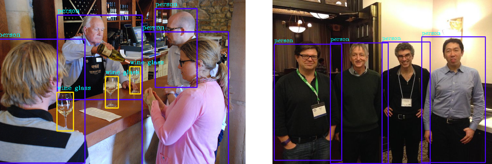
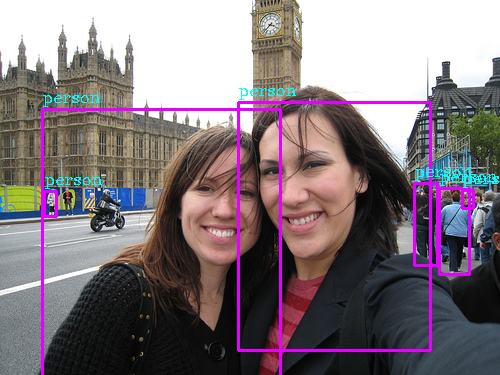

## Introduction

A Tensorflow Implementation of [Yolov3](https://arxiv.org/pdf/1804.02767).

- [X] Detecting objects from pretrained [coco weights]((https://pjreddie.com/media/files/yolov3.weights)) or our trained model.
- [X] Yolov3 training.
- [X] Fine-tuning or Training from scratch.
- [ ] Metrics mAP. 
- [ ] Training process optimization.

## Prepare

+ pretrained darknet weights

    The pretrained darknet weights file can be downloaded [here](https://pjreddie.com/media/files/yolov3.weights). Place this weights file under directory **./data** and then run:
    
    ```
    python convert_weights.py
    ```

+ anchors

    Put anchors in the **./data/anchors.txt**
    
    ```
    10,13,  16,30,  33,23,  30,61,  62,45,  59,119,  116,90,  156,198,  373,326
    ```

After preparation, we will get:
    
```
|--data
    |--yolov3.weights
    |--checkpoints
           |--checkpoint
           |--yolov3.ckpt.data-00000-of-00001
           |--yolov3.ckpt.index
           |--yolov3.ckpt.meta 
    |--anchors.txt
```


## Detect

+ use coco-trained model

    ```
    python detect.py --image_path utils/COCO_test2014_000000000069.jpg
    ```
    or

+ use our trained model

    ```
    python detect.py --image_path utils/2008_002047.jpg --ckpt_path ./checkpoints --names_path ./utils/voc.names --num_classes 20
    ```

## Train

+ train from pretrained coco model

    ```
     python train.py
    ```
    
    or

+ train from our checkpoint model

    ```
     python train.py --restore_ckpt_path ./chcekpoints
    ```   

## Results

+ detection results

    
    
    


## Reference
+ [https://github.com/qqwweee/keras-yolo3](https://github.com/qqwweee/keras-yolo3)
+ [https://github.com/YunYang1994/tensorflow-yolov3](https://github.com/YunYang1994/tensorflow-yolov3)
+ [https://github.com/wizyoung/YOLOv3_TensorFlow](https://github.com/wizyoung/YOLOv3_TensorFlow)
+ [https://github.com/aloyschen/tensorflow-yolo3](https://github.com/aloyschen/tensorflow-yolo3)